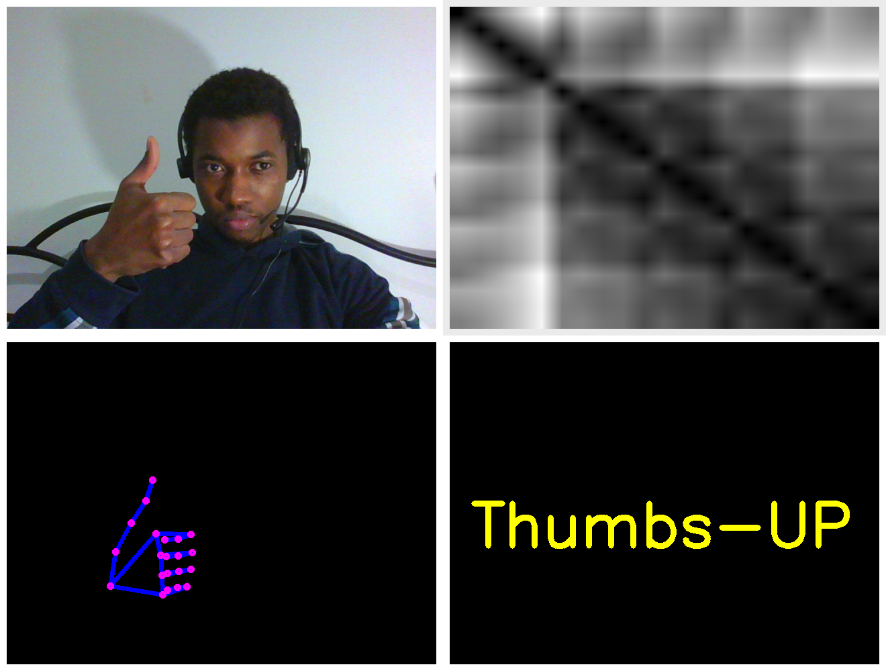

# multimodal-hand-gesture-recognition

<p align="center"> 
  
  <h3 align="center">
    A python script based on opencv and mediapipe that allows to recognize hand gesture
  </h3>  
</p>

---
---


# contents
* [structure](#structure)
* [prerequisites](#prerequisites)
* [installation](#installation)

# structure

this project is structured in a modular way, it is linked to several libraries such as **[opencv, numpy, mediapipe, multiprocessing]** 
It contains the :
* following directories:
    * building
        * allows to grab camera flux and build dataset
        * it used opencv and mediapipe
    * dump
        * is the target location where features will be stored 
        * the features are a triplet : (X0, X1, Y)
        * X0 is an adjacency matrix 
        * X1 is an image of size 32x32 describing a hand sign 
        * Y is the the label to predict
    * models
        * contains the model that was learnt from the learning module       
    * learning
        * contains the logic of building face recognizer models  
        * once the models was build, they will be stored in models directory
    * predicting
        * this module allows to make real time prediction 
        * it is based on opencv and keras  
    * utilities
        * contains usefull function such as : 
        * matrix generation 
        * sign drawing 
        * model creation   
    * static
        * contains image and font for the readme
* following files
    * git config
        * .gitignore
    * project libraries
        * requirements.txt 

# prerequisites
* git
* python3
* python3-venv 

# installation
```bash
    git clone https://github.com/Milkymap/multimodal-hand-gesture-recognition 
    cd multimodal-hand-gesture-recognition
    git checkout -b develop 
    git pull origin develop 
    git checkout features/your_features_name
    python -m venv env 
    source env/bin/activate 
    pip install --upgrade pip 
    pip install -r requirements.txt 
```
